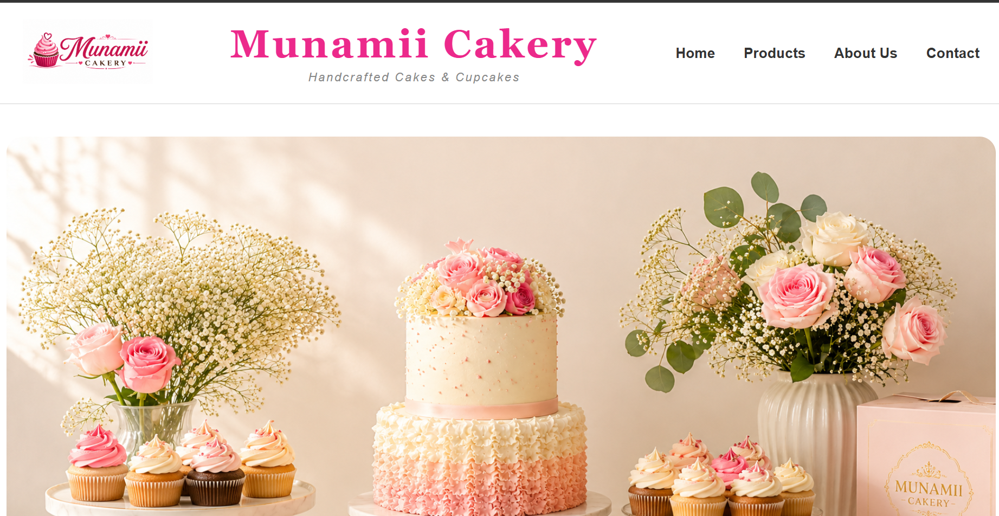

# 🎂 Munamii Cakery Website

A responsive bakery website developed using **HTML5** and **CSS3** for the fictional company **Munamii Cakery**.

The project was created as part of a Front-End Development assignment and demonstrates the use of semantic HTML, CSS styling, responsive design, and modern web development practices.

---

## 📌 Project Overview

Munamii Cakery specializes in handcrafted cakes and cupcakes. The website was designed to showcase products, provide business information, and create an engaging user experience.

---

## 🚀 Features

### Homepage

* Hero banner
* Welcome section
* Featured products
* Call-to-action button

### Products Page

* 8 Cupcake products
* 8 Wedding Cake products
* Product images
* Product pricing
* Hover effects

### About Us Page

* Bakery story
* Business introduction
* Responsive imagery

### Contact Page

* Delivery information
* Order collection information
* Opening hours
* Email contact link
* Social media links
* Location section

---

## 🛠 Technologies Used

* HTML5
* CSS3
* Flexbox
* Responsive Design

---

## 📂 Project Structure

```text
munamii-cakery/

├── index.html
├── products.html
├── about.html
├── contact.html
├── style.css
│
├── images/
│   ├── cupcakes
│   ├── wedding-cakes
│   ├── logo
│   └── bakery-images
│
└── README.md
```

---

## 📱 Responsive Design

The website was tested on desktop and mobile screen sizes using browser developer tools. Flexbox and responsive layouts were used to ensure a consistent user experience across devices.

---

## 🎯 Learning Outcomes

This project helped strengthen my understanding of:

* Semantic HTML
* CSS styling
* Flexbox layouts
* Responsive web design
* Hover effects and transitions
* Multi-page website structure
* GitHub project organization

---

## 📸 Screenshots

### Homepage





### Products Page

```markdown

```

### About Page

```markdown

```

### Contact Page

```markdown

```

---

## 👨‍💻 Author

**Mujahid Ul Islam**

---

## 📄 Disclaimer

This website was created for educational purposes only. Munamii Cakery is a fictional business used as part of a web development assignment.
